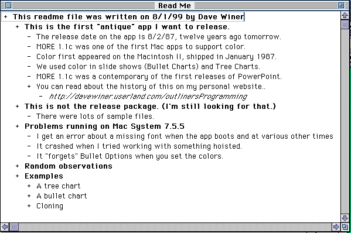

# BorkMore

An outline processor in the style of "More 3" for the classic Mac OS.

## Motivation

I've been wanting to build this a long time, just never had sufficient reason to.  I did
a **lot** of outlining with [More 3](http://www.faughnan.com/more/) between the late 80s
and early 2000s.  The first edition of
[AMOSXP](http://www.amazon.com/Advanced-Mac-OS-Programming-Guides/dp/0321706250/) was
outlined and organized in More 3 on an original
[TiBook](http://www.everymac.com/systems/apple/powerbook_g4/specs/powerbook_g4_1.0.html).
To this day I still use outlines to sketch out ideas for writing, and for building
course materials.

There was something about the speed and simplicity of the workflow of the More outliners
that appealed to me.  It was very quick and easy to do promotion, demotion, cloning, and
hoisting. Plus each item had a full text document - just press the Enter key to expand
and collapse it (as distinct from the Return key).  I never used the word processing,
tree layout, or slideshow features.

I also need to work on my technical skills again. This will be a great project to let me:

* Get back up to speed with modern Cocoa.  I've been an iOS monkey for entirely too long.
* Do a real live project in Swift.  It Is The Future&trade;. That's the only way I learn a technology deeply.

## Why not just use _xyz_?

[OmniOutliner](https://www.omnigroup.com/omnioutliner/) is a great piece of software,
and I have a huge amount of respect for the folks who have worked on it, and still work
on it.  It just does too much.  I find myself slogging through features I don't need,
and the conveniences I do want weren't as fast under my hands as I remembered More 3
being.

## What did it look like?

Have some screen shots:

